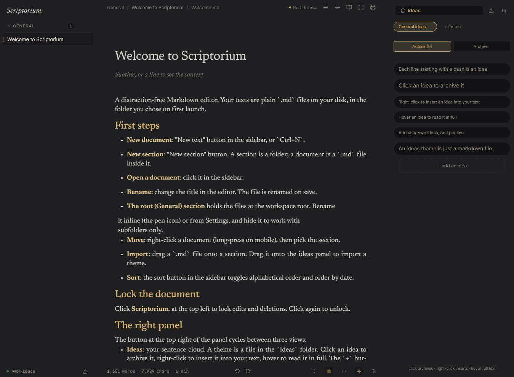

# Scriptorium

A distraction-free markdown writer that reads and writes plain `.md` files on
your own disk. Built for long-form work: manifestos, essays, notes, drafts.

[infinition.github.io/scriptorium/](https://infinition.github.io/scriptorium/)

The editor stays out of your way. Headings, lists, code blocks and math render
in place; the line under your cursor switches to raw markdown so you can edit
it like a regular text file. Nothing leaves your machine.

Alongside the editor sits the thing the app is arranged around: **Ideas**. A
sentence you think of now rarely belongs where you are writing now, so it goes
into a cloud beside your text instead of interrupting it. Ideas are grouped
into themes, one plain `.md` file per theme, and everything about them is drag
and drop: reorder one inside its theme, drop it on another theme's tab to move
it there, or drag it into the document to insert it as a block exactly where
you let go.



## Usage

Scriptorium runs two ways, from the same codebase:

- **Web server**: run `node server.js`, open `http://localhost:3000`. Works in
  any browser, including on a phone or tablet on your local network.
- **Desktop GUI**: a native window (Tauri) that launches the same server and
  displays the app. Identical behaviour, no browser needed.

### Web server

```bash
npm install
npm start
```

Then open `http://localhost:3000`.

The server binds to `127.0.0.1` by default. To reach it from another device on
your network, run `HOST=0.0.0.0 npm start`; it then prints a URL with an access
token.

### Desktop GUI (Tauri)

```bash
npm install
npm run tauri:dev
```

The native window starts the same Node server and shows the app. Node must be
available in the `PATH`.

A build pipeline (GitHub Actions) produces installers for Windows, Linux and
macOS on every `v*` version tag. Binaries are on the releases page:
<https://github.com/infinition/scriptorium/releases>

### Installing the packaged app

Prebuilt installers are attached to every `v*` release on the releases page.
Replace `<version>` below with the version you downloaded, for example
`1.3.1`.

**Windows**

Run `Scriptorium_<version>_x64-setup.exe`. There is also a portable single file,
`Scriptorium_<version>_x64.exe`, which needs no installer: on first run it
unpacks its server and Node runtime into `%APPDATA%\Scriptorium\portable` and
keeps its `config.json` there, so the exe travels but the workspace setting
stays on the machine that ran it.

**macOS** (Apple Silicon)

Open `Scriptorium_<version>_aarch64.dmg` and drag Scriptorium into Applications.
The app is not signed with an Apple developer certificate, so Gatekeeper refuses
to open it and reports it as damaged. Clear the quarantine flag once, then the
app opens normally:

```bash
xattr -cr /Applications/Scriptorium.app
```

**Linux (AppImage)**

The AppImage needs the executable bit before it can run:

```bash
chmod +x Scriptorium_<version>_amd64.AppImage
./Scriptorium_<version>_amd64.AppImage
```

If your distribution ships FUSE 3 only, install `libfuse2` (on Debian and
Ubuntu: `sudo apt install libfuse2`), or extract the image and run it from
there with `--appimage-extract`.

**Linux (.deb)**

```bash
sudo dpkg -i Scriptorium_<version>_amd64.deb
```

Then launch Scriptorium from the applications menu, or run `scriptorium` from a
terminal.

The `.deb` is the one format that does not update itself. A package installed
system-wide belongs to the package manager, not to the application, so
Scriptorium tells you when a new version is out and leaves the install to
`dpkg`. Every other format updates in place from the app.

The AppImage, the `.deb`, the macOS app and the portable Windows exe all carry
their own Node runtime and the server, so Node does not need to be installed on
the target machine.

## First launch

On first launch, when no working folder has been configured yet, the app asks
you to pick an existing folder or create one, and to choose the interface
language (English by default, French available). The choices are saved in
`config.json`, next to `server.js`. Change the folder later from the gear icon
in the sidebar, or edit `config.json` directly.

A fresh empty workspace is seeded with a bilingual guide (French and English)
describing every feature, plus two general ideas themes, one per language.

## Workspace layout

Scriptorium mirrors a folder you own, structure for structure:

```
workspace/
  Manifestos/                      <- a section (sidebar group)
    my-document.md                 <- a document
  Essays/
    welcome.md
  ideas/                           <- the sentence-cloud source
    general.md                     <- one theme per file
  .scriptorium/                    <- app-managed: settings, themes, fonts,
  |                                  backgrounds, icons, snapshots (per workspace)
  .medias/                         <- images inserted in documents
  assets/                          <- legacy image folder, kept for old documents
```

- A subfolder is a section. Rename the folder, the section renames.
- A `.md` at the root lands in the implicit "General" section, which you can
  rename or hide from Settings.
- Drag a `.md` onto a section to import it.
- `ideas/*.md` files feed the ideas panel. Each line starting with `- ` is an
  idea; `- [x] ...` means archived. The files are rewritten in place when you
  click an idea, so editing them from another editor works too.
- `.scriptorium/` keeps every preference of this workspace (theme, fonts,
  backgrounds, icons, spacing, language). Copy the workspace folder and the
  whole setup follows.
- `.medias/` holds the images you paste, drop or drag into documents.

Filenames are derived from the title (slugified, ASCII). Change the title and
the file is renamed on save.

## Features

- **Lock**: click "Scriptorium." at the top left to block edits and deletions.
  Enforced server-side, not just in the UI.
- **Right panel**: the button at the top of the panel cycles between ideas,
  table of contents and snapshots.
- **Ideas**: a sentence cloud grouped by theme. Click to archive, right-click
  to insert into the text, hover to read. Drag ideas to reorder them, drop
  them on another theme's tab to move them, or drag them into the editor to
  insert them as blocks. Search filters the current theme.
- **Emoji picker**: type `@@` in any text field (editor, titles, ideas) to open
  a searchable emoji palette.
- **Custom UI icons**: import your own icons (SVG, PNG, WebP, ICO) into the
  `.icons` folder and replace any UI icon, per theme.
- **Themes**: built-in and named custom themes in `.themes`, with clone, reset
  and per-color alpha. Each theme carries its own UI font, editor font (custom
  fonts from `.fonts`) and a background image or video (opacity slider,
  seamless mosaic). Adjustable space between blocks and line height.
- **Table of contents**: the headings of the document. Click a heading to jump
  to the section.
- **Snapshots**: a document's revision history. Take a snapshot before a big
  cut, compare, restore (the current version takes its place in the list),
  delete.
- **Breadcrumb**: click it to go back to the top of the document. Click the
  filename to copy it.
- **Focus mode** (`F`), **typewriter** (`T`), **paragraph focus** (`P`),
  **reading mode** (`R` or `Tab`), **auto-scroll** (`A`), **readable line
  length** (full-width toggle).
- **Search** (`Ctrl+P`): full text across documents and ideas.
- **Find / Replace** (`Ctrl+F`): on the raw markdown source.
- **Export**: print / PDF, standalone HTML, Markdown.
- **Images**: paste, drop or drag an image onto the editor. It is saved into
  the workspace `.medias/` folder and inserted as a markdown reference; the
  drop target is shown with the same insertion line as an idea drag. Type `%%`
  in any text field to open a media gallery (thumbnails, scroll), insert one
  instead of `%%`, delete one directly, or import more. In Settings > Appearance
  you can align images (left, center, right) and cap their width.
- **Paper mode**: Settings > Appearance can turn the editing area into a white
  page with rounded corners, like a sheet of paper. The font preview in the
  panel mirrors the white page so what you see is what you get.
- **Root section**: the root (General) section holds the files at the workspace
  root. Rename it inline or from Settings, and hide it (right-click > Hide
  section, or the Settings toggle) to work with subfolders only.
- **Language-aware seeding**: a fresh empty workspace seeds only the welcome
  document and demo idea theme for the interface language you pick (EN or FR).
- **Drop tolerance**: dragging an idea or an image over the editor snaps on
  each block midpoint, so the insertion line never vanishes.
- **Spell check**: corrections are applied to the raw markdown, and a
  right-click keeps the suggestion menu working.
- **Language**: the interface is fully translated in English and French, and
  the choice is offered on first launch.
- **Safety**: paths coming from the client are confined to the workspace. A
  section or document name can only ever be a single path segment.

A plugin API roadmap is drafted in `docs/plugin-api-roadmap.md`.

## Keyboard shortcuts

| Shortcut | Action |
|---|---|
| `Ctrl+N` | New document |
| `Ctrl+S` | Save |
| `Ctrl+P` | Search |
| `Ctrl+F` | Find / Replace |
| `Ctrl+G` or `Ctrl+B` | Bold |
| `Ctrl+I` | Italic |
| `Ctrl+K` then `C` | Change heading level |
| `Ctrl+K` then `Q` | Quote |
| `Ctrl+K` then `L` | List |
| `Ctrl+K` then `U` | Underline |
| `Ctrl+K` then `D` | Inline code |
| `Ctrl+Z` / `Ctrl+Shift+Z` | Undo / Redo |
| `T` | Typewriter |
| `P` | Paragraph focus |
| `R` or `Tab` | Reading mode |
| `A` | Auto-scroll |
| `F` | Focus mode |

## Markdown support

CommonMark plus a few extensions used by Obsidian and GitHub:

- Headings, lists, ordered lists, task lists (`- [ ]` / `- [x]`)
- Bold, italic, strikethrough, underline (via `<u>`), inline code, highlight (`==text==`)
- Links, wikilinks (`[[name]]`), images
- Blockquotes and Obsidian-style callouts (`> [!info] Title`)
- Tables
- Horizontal rules
- Fenced code blocks with syntax highlighting (`highlight.js`)
- Inline LaTeX (`$x^2$`) and display LaTeX (`$$ ... $$`) via KaTeX
- Footnotes (`[^1]`)

## Development

- Node.js + Express on the server side. The whole API is in `server.js`.
- No framework on the client: `public/{index.html, app.js, style.css}`.
- `highlight.js` and `KaTeX` are installed as dependencies and served from
  `node_modules` under `/vendor`. No CDN, everything works offline.
- Fonts: Newsreader (body), Inter (UI), JetBrains Mono (code).
- The desktop version uses Tauri (WebView2) as a window over the Node server.
  `src-tauri/src/lib.rs` launches `node server.js` and opens the window on its
  URL.
- The presentation site lives in `docs/` and is published on GitHub Pages.

## License

ISC. See `package.json`.
